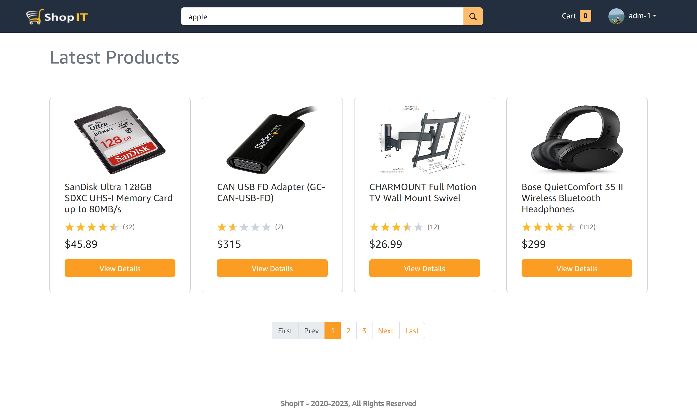
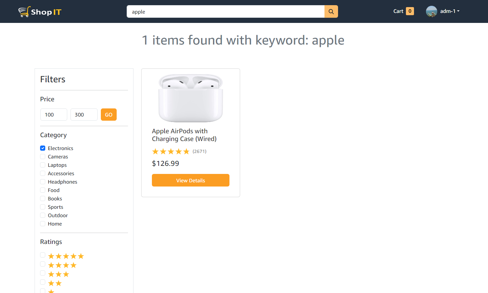
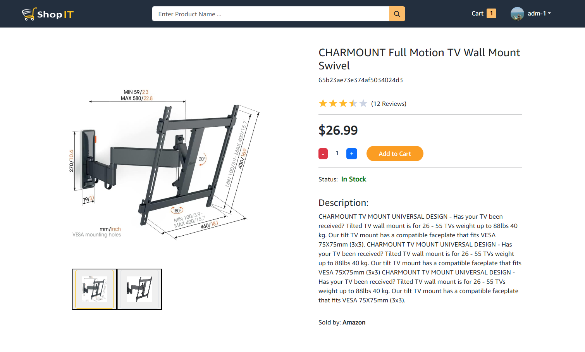
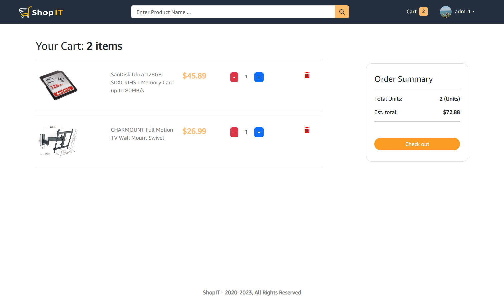
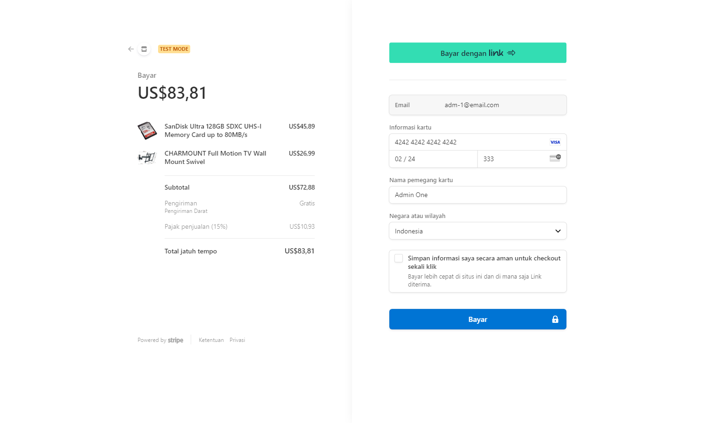
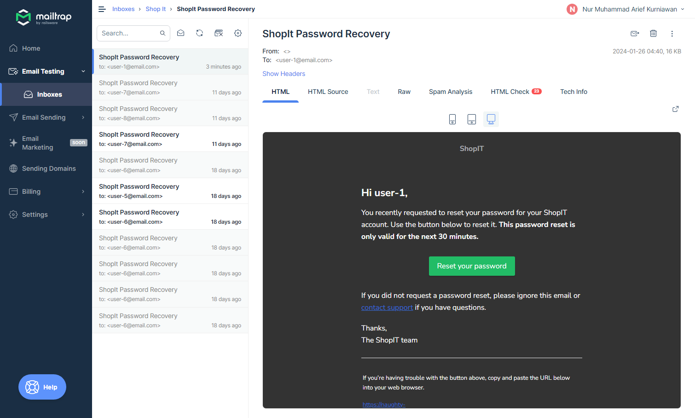
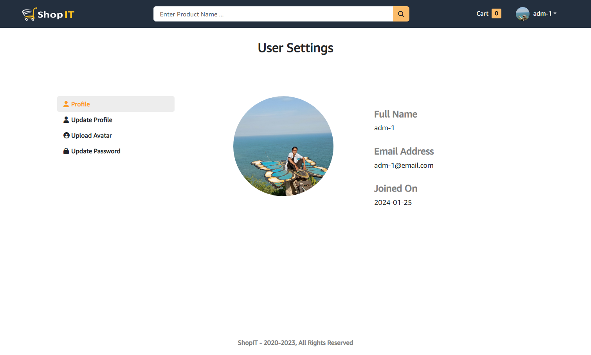
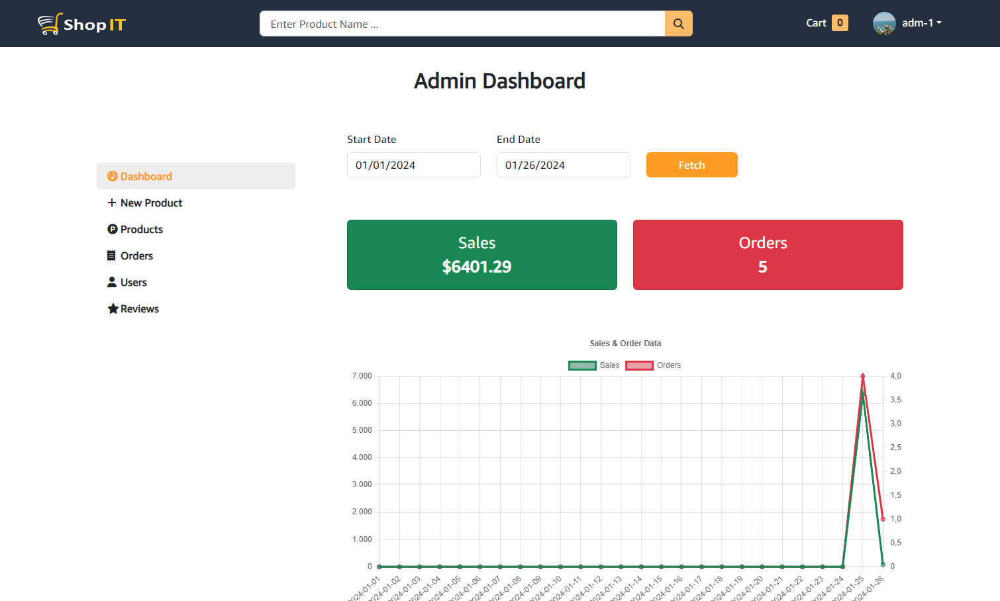

# Shop It

This is an exercise project to build a fullstack e-commerce app with MERN STACK.

## Table of contents

- [Overview](#overview)
  - [Features](#features)
  - [Screenshot](#screenshot)
  - [Links](#links)
- [My process](#my-process)
  - [Built with](#built-with)
  - [What I learned](#what-i-learned)
- [Author](#author)

## Overview

### Features

1. Authentication with jsonwebtoken:
   1. Register, login, logout
2. Authorization:
   1. User role: See profile, update profile, see orders, add products to cart,
      checkout cart
   2. Admin Role: Add product, update product, delete product, see users, update users,
      see orders, update orders
3. Search products:
   1. Filter by keyword, price, category, ratings
4. Payments:
   1. Payment with stripe

### Screenshots

#### User

1. Home
   

2. Search products
   

3. Product Details
   

4. Cart
   

5. Checkout with stripe
   

6. Email for password recovery
   

7. My profile
   

#### Admin

1. Admin Dashboard
   

### Links

- [Github repo](https://github.com/nurmarief/shop-it)
- [Live site](https://naughty-rooster.cyclic.app/)

## My process

### Built with

1. Back-end

   - Express
   - Mongodb (with mongoose)
   - Jsonwebtoken
   - Nodemailer & Mailtrap
   - Cloudinary (To save user avatar and product images)
   - Stripe

2. Front-end
   - Reactjs
   - React redux & Redux Toolkit
   - React router dom

### What I learned

1. Back-end
   - General: RESTful API
   - Mongoose: create model, assign a custom function to a schema, aggregate
2. Front-end
   - Useful reactjs 3rd party library: mdbreact, react-chartjs-2, react-datepicker, react-helmet, react-hot-toast, react-js-pagination, react-star-ratings
   - Redux toolkit: query, mutation, and provide and invalidate tags
